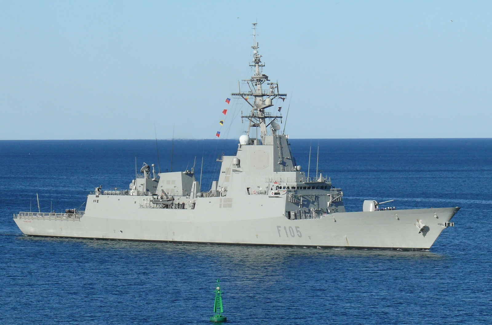

# Fragatas Clase Álvaro de Bazán (F-100)
Las fragatas F-100 son buques de defensa aérea de largo alcance, con capacidades avanzadas en guerra antisubmarina y guerra electrónica.

Están equipadas con el sistema de misiles AEGIS, que les permite realizar defensa aérea en zonas amplias y coordinarse con otras unidades para interceptar amenazas.

Se encuentran en el Arsenal Militar de Ferrol, en La Coruña.

Estas fragatas son:

- Álvaro de Bazán (F-101)

</img>

- Almirante Juan de Borbón (F-102)

</img>

- Blas de Lezo (F-103)

</img>

- Méndez Núñez (F-104)

</img>

- Cristóbal Colón (F-105)

</img>