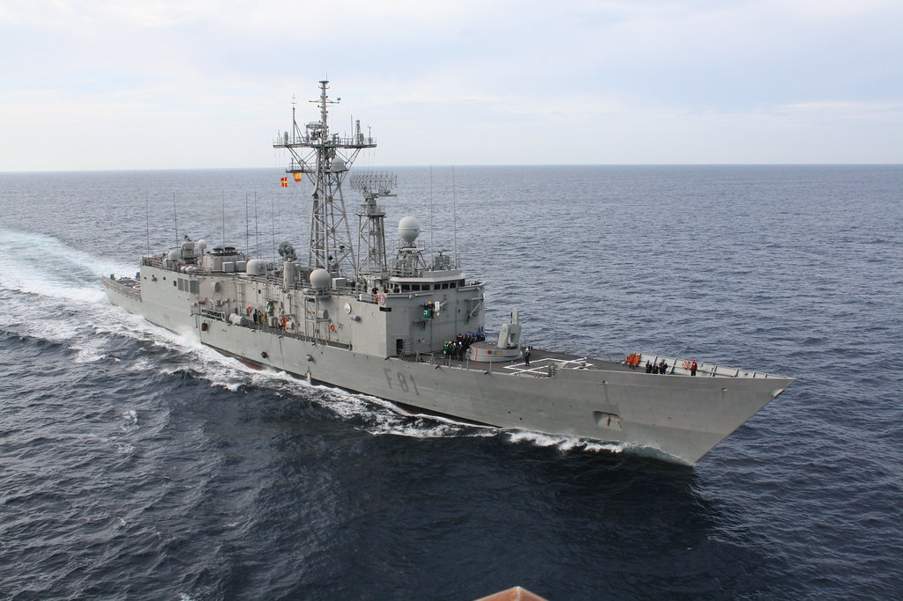
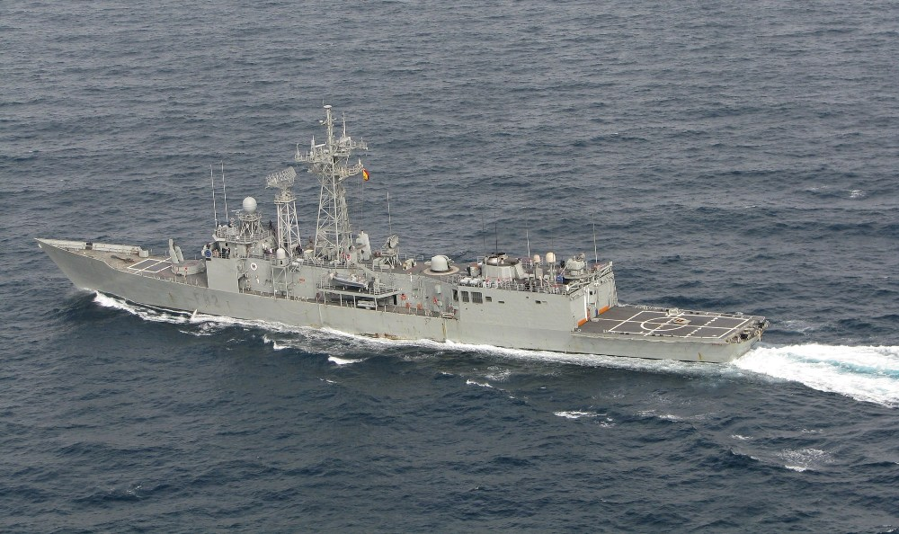
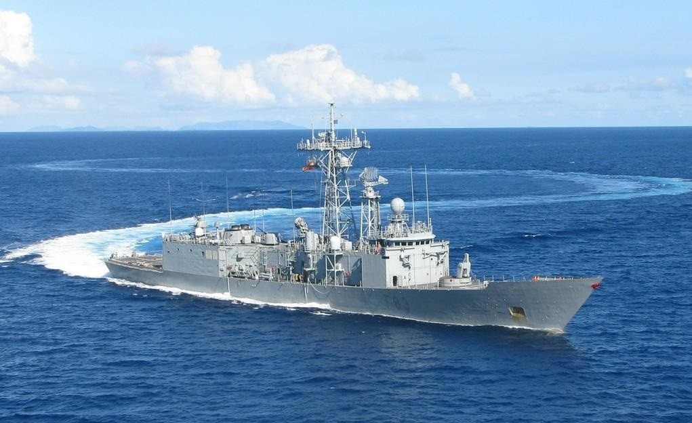
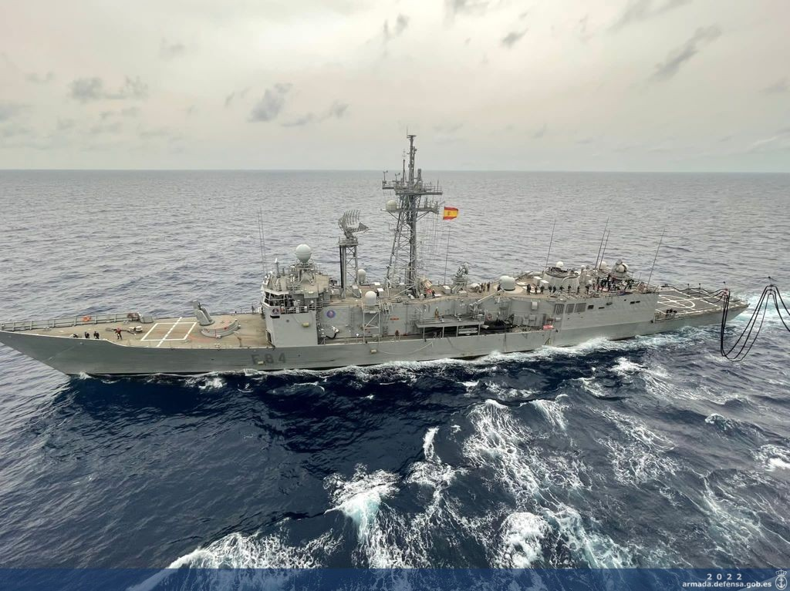
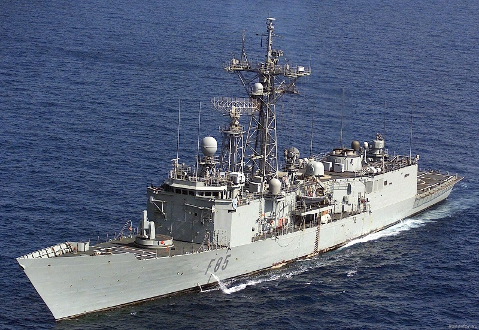
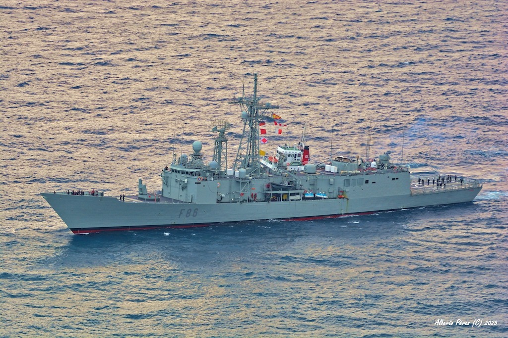

# Fragatas Clase Santa María (F-80)
Las fragatas F-80, con una dotación de unas 215 personas, son buques más ligeros que las F-100, pero igualmente versátiles en guerra antisubmarina, vigilancia costera y defensa de patrullas y convoyes. Su capacidad de maniobra y alcance operacional les permite desempeñar funciones tanto en el mar abierto como en zonas cercanas a la costa.

Se encuentran en la Base Naval de Rota, en la Bahía de Cádiz.

Estas fragatas son:

- **Santa María (F-81)**

</img>

- **Victoria (F-82)**

</img>

- **Numancia (F-83)**

</img>

- **Reina Sofía (F-84)**

</img>

- **Navarra (F-85)**

</img>

- **Canarias (F-86)**

</img>