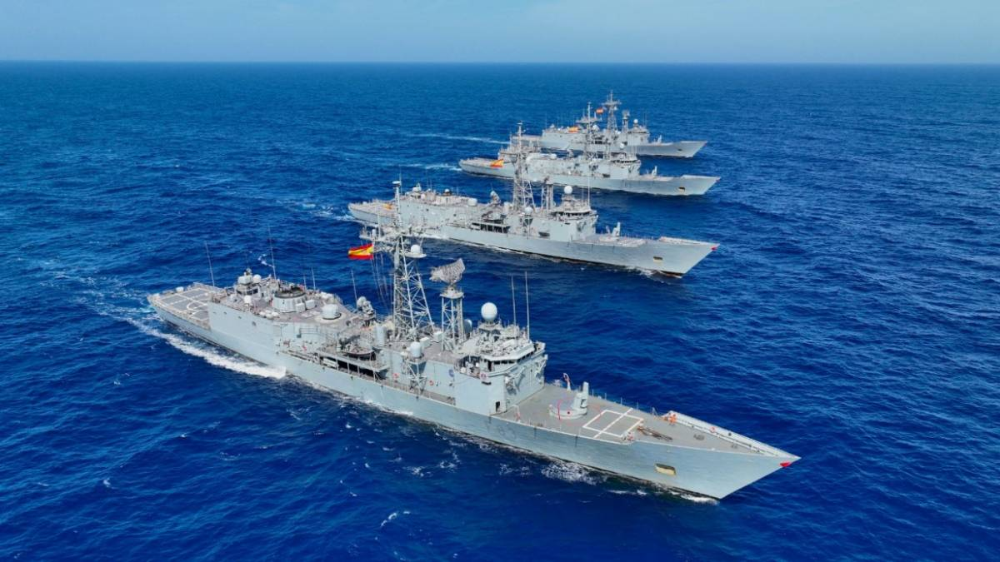

# Fragatas
Las fragatas son **buques de guerra multifuncionales**. Están diseñados principalmente para misiones de defensa aérea, guerra antisubmarina, patrullaje y escolta.

Son buques **rápidos y ágiles**, con una capacidad de maniobra avanzada, ideales para operaciones en mar abierto y en zonas costeras.

Su armamento incluye misiles, sistemas de radar y sonar y armas de fuego para protección.

Se suelen hacer misiones de entre 3 y 6 meses.

En la Armada Española tenemos 2 clases de Fragatas:

- **Clase Álvaro de Bazán (F-100)** -- Ferrol

- **Clase Santa María (F-80)** -- Rota

Dentro de unos años (se espera sobre 2028) llegará una nueva clase de fragatas a Rota para sustituir la clase F-80 que ya cuenta con 3 décadas de servicio: la **Clase Bonifaz (F-110)**.

</img>