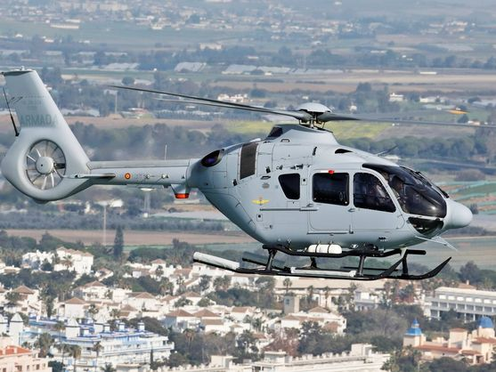
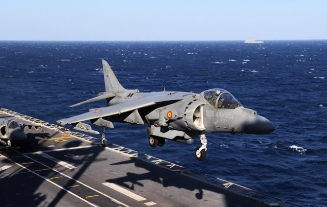
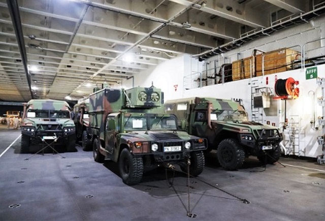
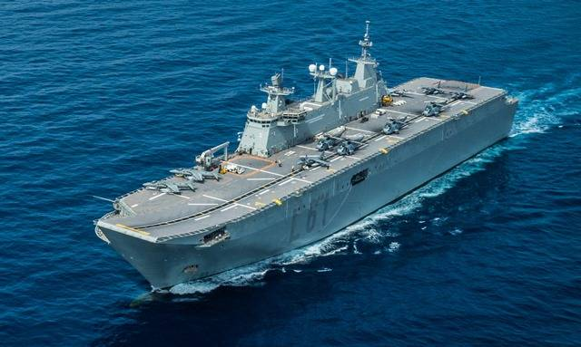
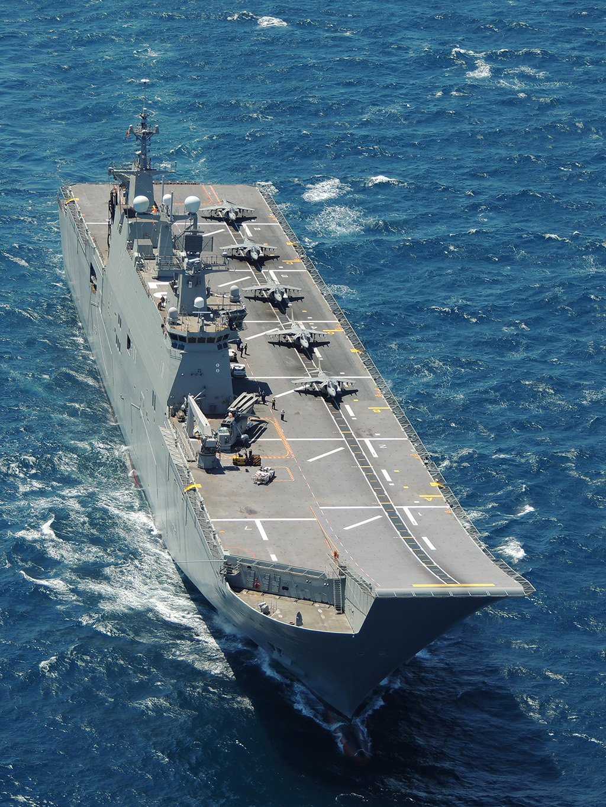

# LHD Juan Carlos I (L-61)
El LHD Juan Carlos I (L-61) es el mayor buque de la Armada Española. Cuenta con una dotación de **295 personas**, y en misiones importantes ha llegado a llevar hasta 1500 personas en él.

Tiene capacidad para poder transportar y operar con hasta 30 aeronaves entre helicópteros medios y pesados en el perfil de operaciones anfibias, o bien entre 10 y 12 aviones F35B o AV-8B+.

</img>

</img>

Cumple una doble función como buque anfibio y portaeronaves y se ha diseñado con 4 perfiles de misión:

- Como **buque anfibio**, capaz de transportar a una Fuerza de Infantería de Marina para realizar un desembarco.

</img>

- Como **buque de proyección de fuerza**, transportando fuerzas de cualquier ejército a un teatro de operaciones.

- Como plataforma eventual para la **aviación embarcada**, sirviendo de plataforma a los vectores aéreos de proyección estratégica.

- Como buque para **operaciones no bélicas** (apoyo humanitario, evacuación de personal de zonas de crisis, buque-hospital en zonas afectadas por catástrofes...)

Se encuentra en la **Base Naval de Rota, en la Bahía de Cádiz**.

</img>

</img>
