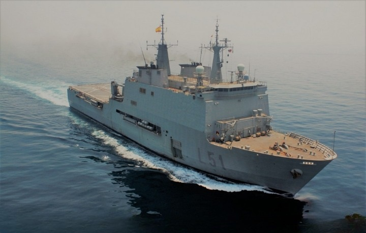
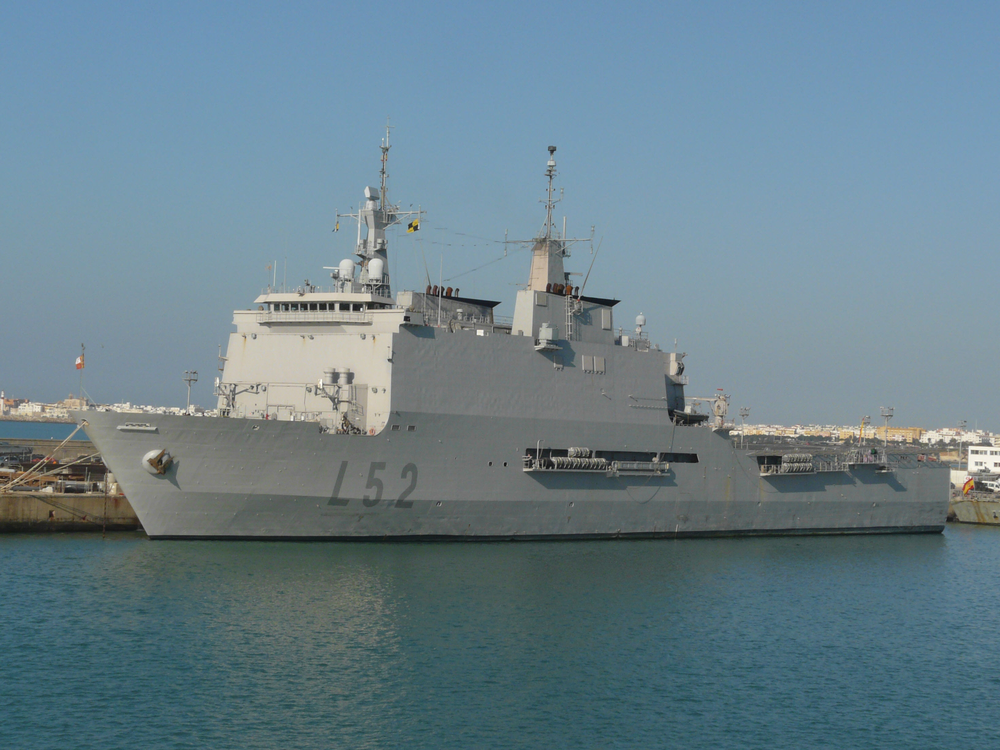

# B.A.A. Clase Galicia (L-50)
Estos Buques de Asalto Anfibio se encuentran en la **Base Naval de Rota, en la Bahía de Cádiz**. Cuentan con una dotación de entre **185 y 200 personas**.

Al ser buques anfibio, están diseñados para transportar tropas y vehículos y para operar con embarcaciones anfibias en su dique y con helicópteros en su cubierta de vuelo.

La misión principal de los buques de esta clase es llevar a cabo **operaciones anfibias**. Sus misiones también incluyen operaciones de mantenimiento de la paz y de ayuda humanitaria, mediante apoyo médico y quirúrgico, en catástrofes naturales, ya que cuenta con un hospital a bordo de grandes prestaciones.

Estos buques son:

- **Galicia (L-51)**

También está capacitado para actuar como Buque de Mando de la Fuerza Anfibia y de la Fuerza de Desembarco y como Buque de Mando Alternativo de un Mando de Componente Marítimo.

</img>

- **Castilla (L-52)**

También actúa como plataforma de mando del Cuartel General Marítimo de Alta Disponibilidad que España pone al servicio de la OTAN

</img>
