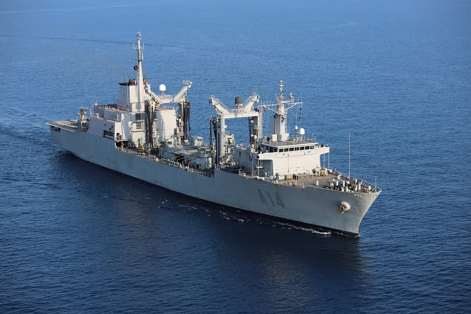
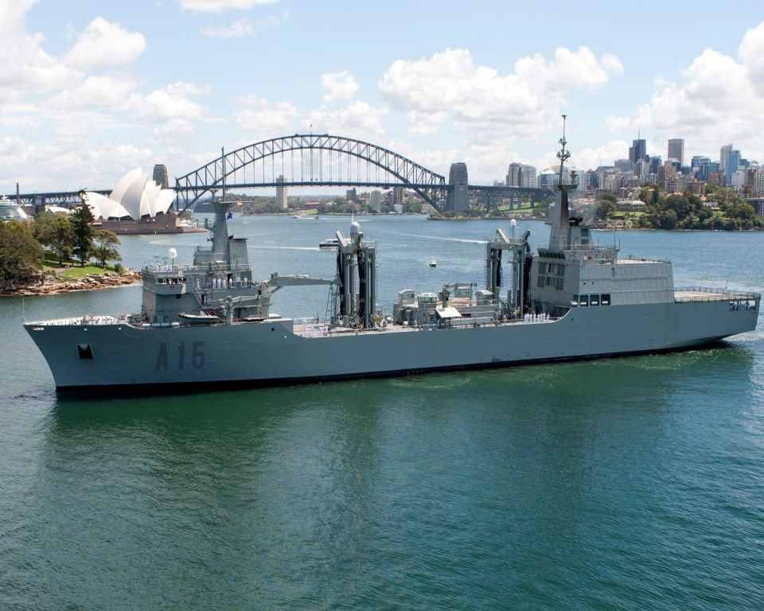

# Buques Logísticos
Los buques logísticos desempeñan un papel crucial en la Armada Española al **proporcionar apoyo y suministro a otras unidades navales en alta mar**.

Su principal función es **repostar combustible, munición, alimentos y otros suministros esenciales** a los buques de combate, permitiendo operaciones prolongadas sin necesidad de regresar a puerto.

Estos buques suelen realizar despliegues de 3 a 6 meses.

En la Armada Española tenemos 2 buques logísticos principales. Ambos son son **Buques de Aprovisionamiento en Combate** y se encuentran en el **Ferrol**. Su misión es proporcionar apoyo logístico en el mar (comida, agua, combustible...), disponiendo de estaciones de aprovisionamiento en las bandas y la popa para transferir líquidos y sólidos. También cuentan con hangares para helicópteros o algunas embarcaciones. Cuentan con una dotación de entre **150 y 165 personas**:

- **B.A.C. Patiño (A-14)**

Está enfocado en apoyar a grupos de combate y tiene sistemas más antiguos.

</img>

- **B.A.C. Cantabria (A-15)**

Es más grande y moderno, con mayor capacidad de carga.

</img>
