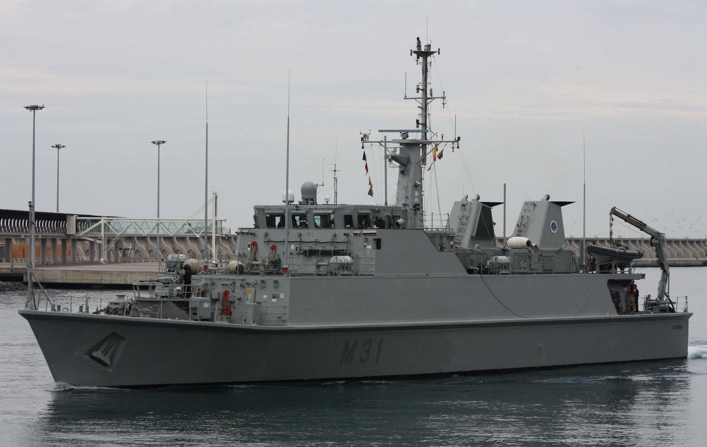
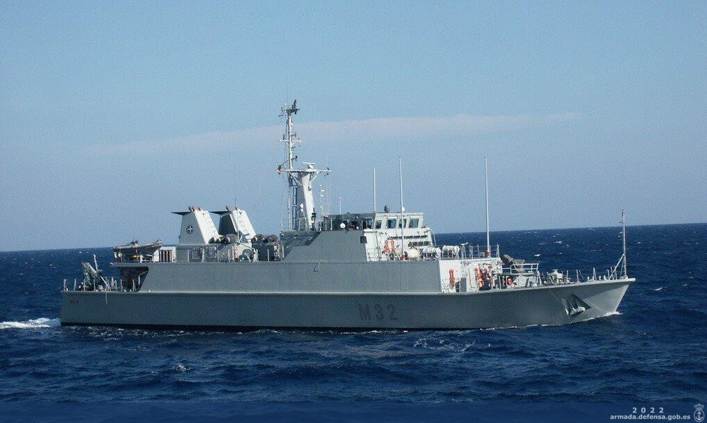
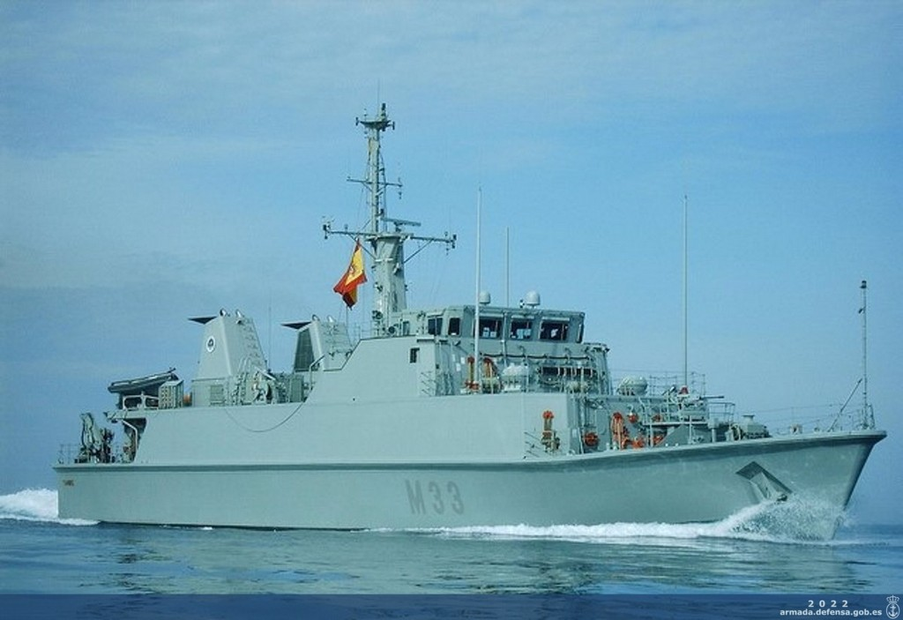
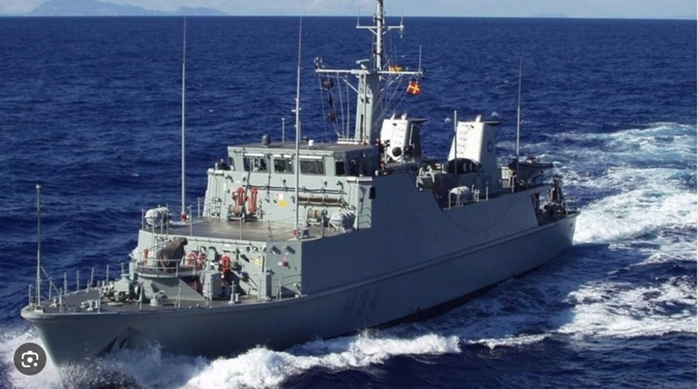
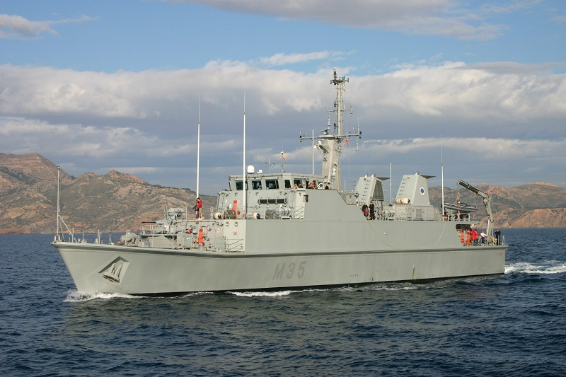
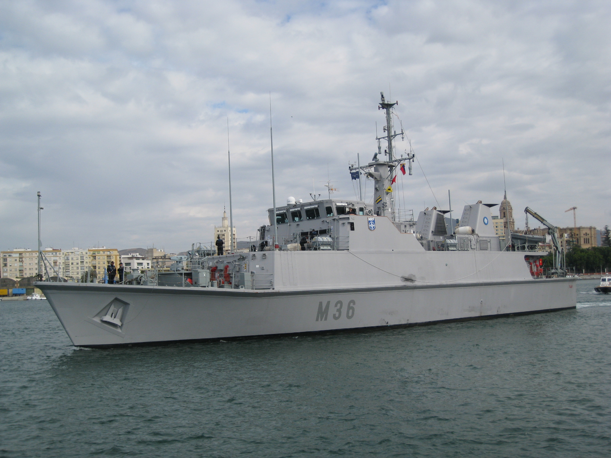

# Buques Medidas contra Minas
Los Buques Medidas contra Minas tienen la misión de **detectar, localizar e identificar y neutralizar minas navales**, asegurando la seguridad en rutas marítimas, puertos y zonas de operaciones militares.

Son esenciales para la protección de la flota y el mantenimiento de la libertad de navegación en aguas potencialmente peligrosas.

Sus capacidades generales son:

- Detección y eliminación de minas submarinas

- Operación en aguas poco profundas y áreas estratégicas

- Uso de drones submarinos y sistemas de desminado remoto

- Estructura no magnética para reducir el riesgo de activación de minas

Estos buques no están en el mar constantemente como fragatas o buques logísticos, ya que su labor es más especializada y localizada, por lo que estos buques pueden navegar como mucho entre 2 y 4 meses al año en despliegues y ejercicios.

En la Armada Española tenemos 6 cazaminas de la **Clase Segura (M-30)** ubicados en el **Arsenal de Cartagena** que están diseñados con materiales no magnéticos y cuentan con equipos avanzados de detección y eliminación de minas, como sonares de alta frecuencia, vehículos submarinos no tripulados y sistemas de neutralización remota. Cuentan con una dotación de unas **40 personas** cada uno:

- **Cazaminas Segura (M-31)**

</img>

- **Cazaminas Sella (M-32)**

</img>

- **Cazaminas Tambre (M-33)**

</img>

- **Cazaminas Turia (M-34)**

</img>

Y ahora los más modernos de la serie: los M-35 y M-36:

- **Cazaminas Duero (M-35)**

</img>

- **Cazaminas Tajo (M-36)**

</img>
