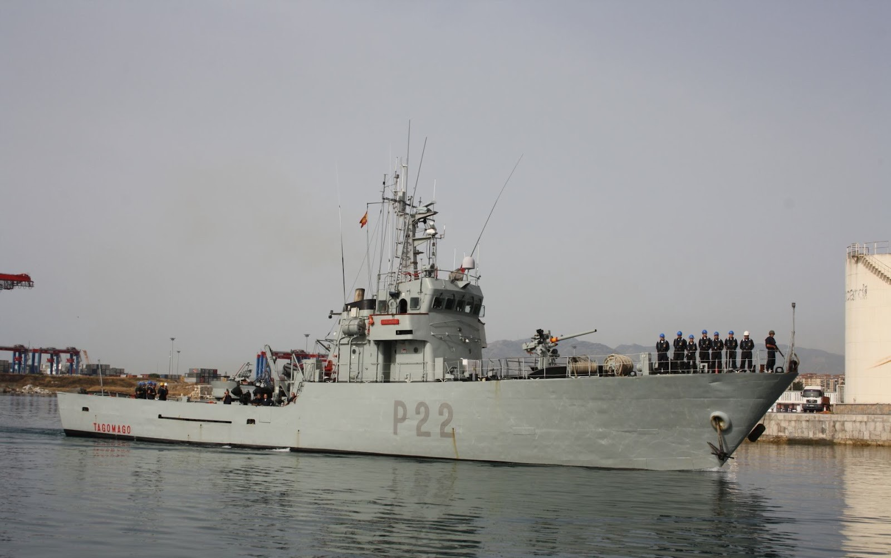
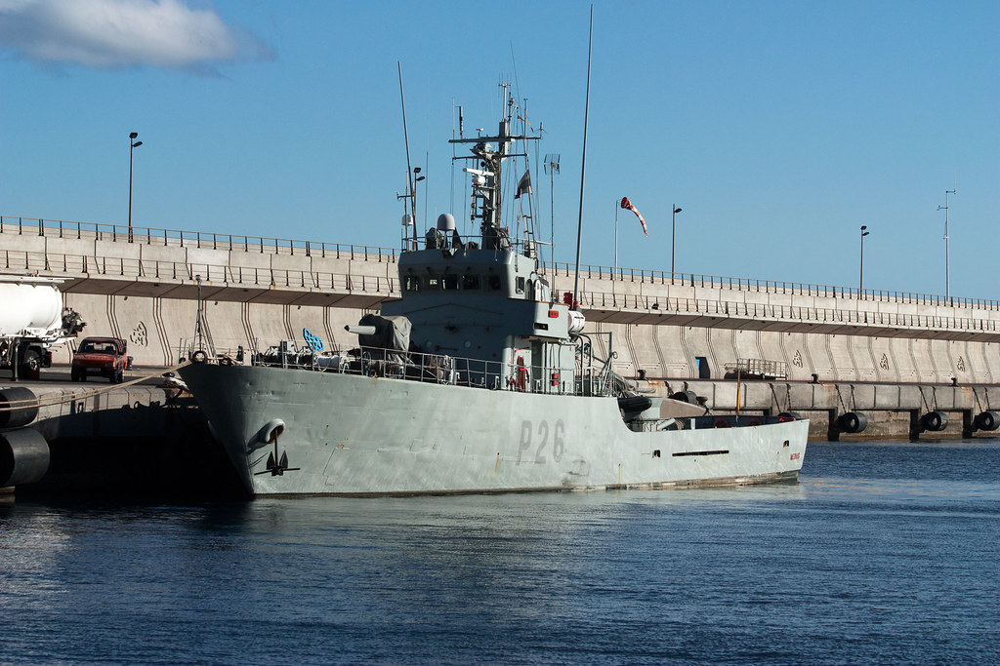
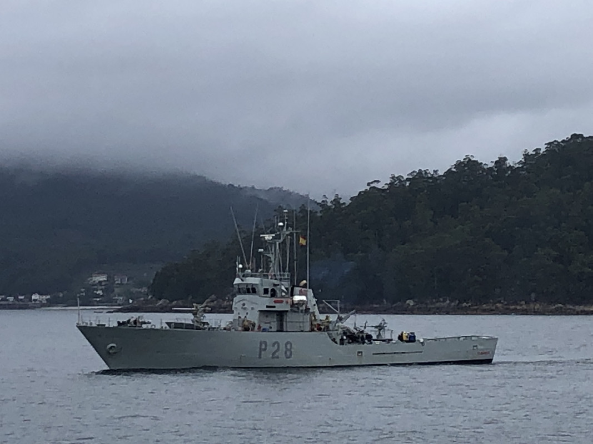

# Patrulleros Clase Anaga (P-20)
Los patrulleros de la Clase Anaga (P-20) están diseñados para el servicio de **vigilancia de costas, pesca y salvamento en caso de naufragio o accidentes** en la mar.

Los patrulleros que siguen ahora mismo en activo son:

- **Patrullero Tagomago (P-22)** -- Málaga

</img>

- **Patrullero Medas (P-26)** -- Cádiz

</img>

- **Patrullero Tabarca (P-28)** -- Marín

</img>
