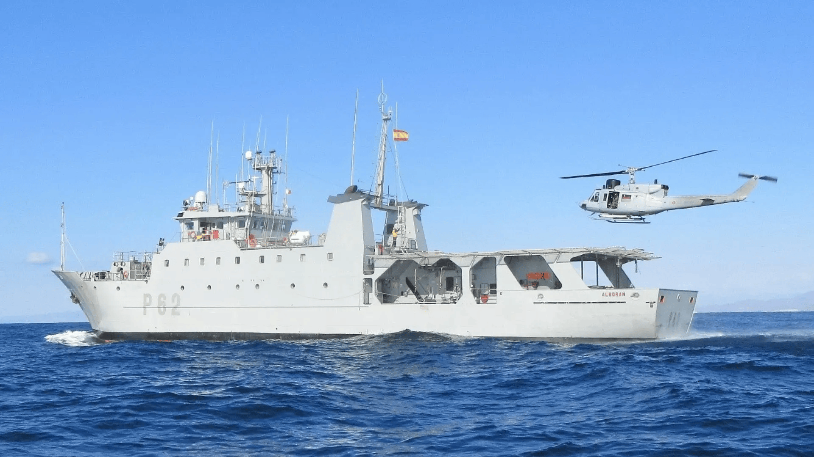
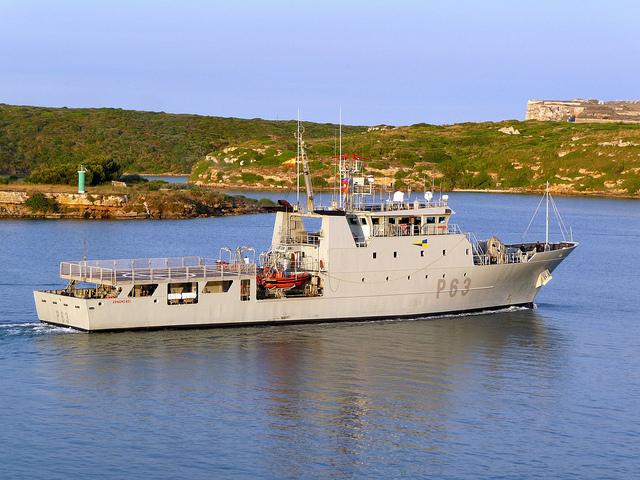
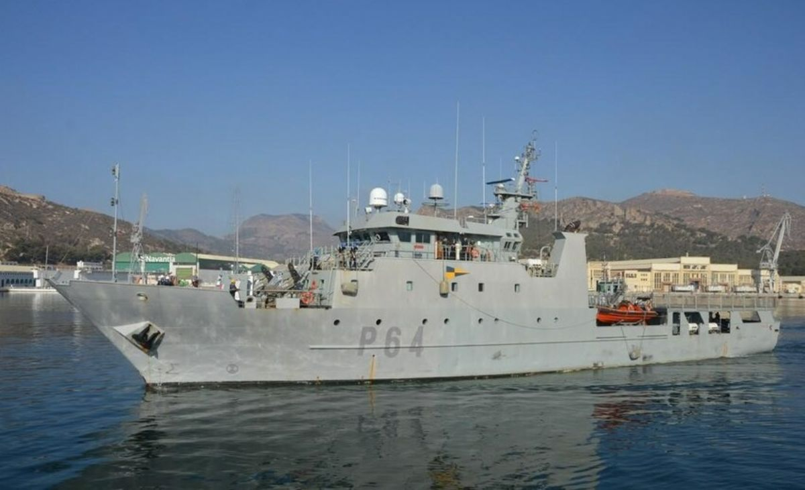

# Patrulleros de Cooperación Pesquera (P-60)
Como su nombre indica, estos patrulleros están diseñados para la **vigilancia, inspección y apoyo a la flota pesquera**.

Los patrulleros que siguen ahora mismo en activo son:

- **Patrullero Alborán (P-62)** -- Cartagena

</img>

- **Patrullero Arnomendi (P-63)** -- Ferrol

</img>

- **Patrullero Tarifa (P-64)** -- Cartagena

</img>
