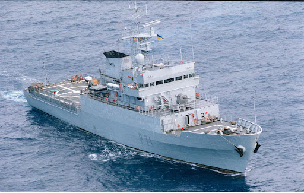
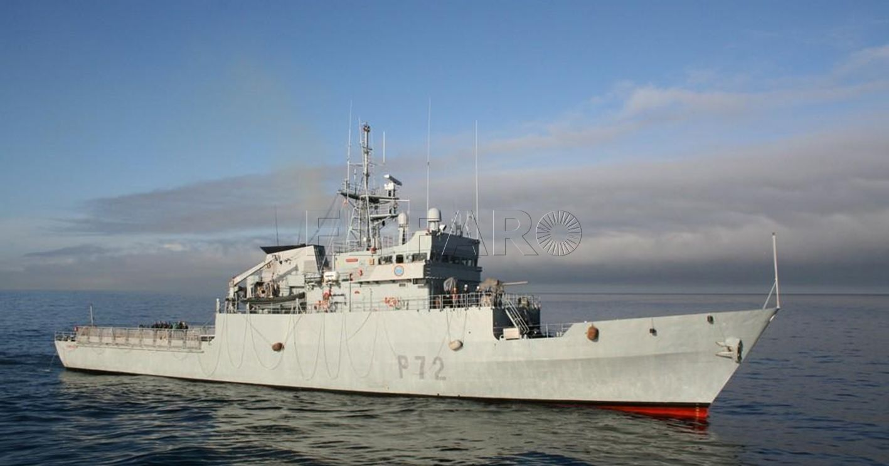
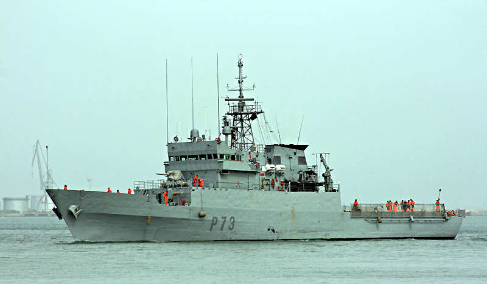
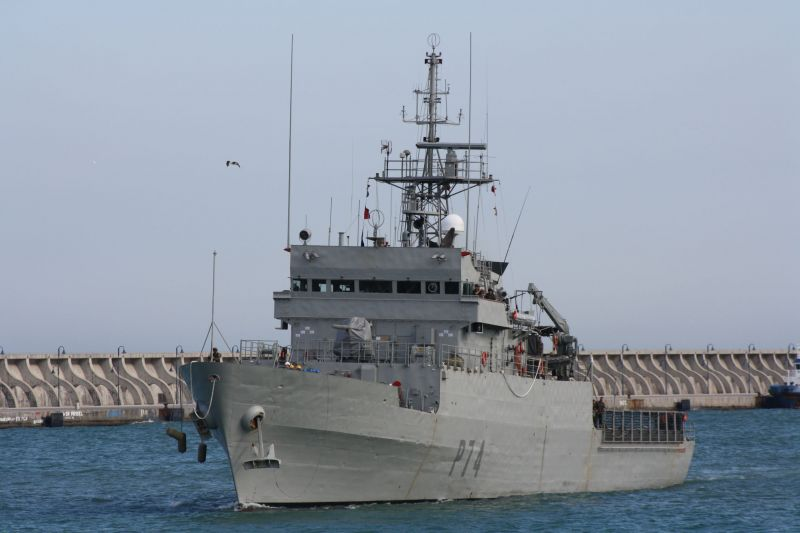
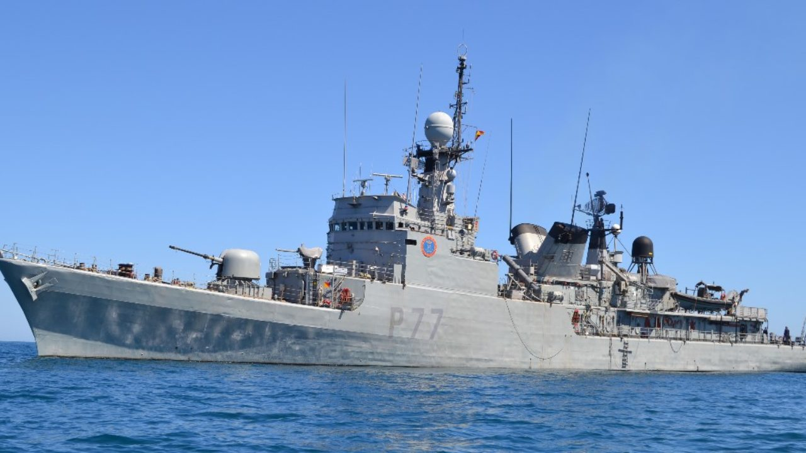

# Patrulleros Clase Serviola (P-70)
La misión de estos patrulleros es proteger los intereses nacionales en los espacios marítimos de soberanía e interés nacional.

Están capacitados para:

- **Vigilar, prevenir, disuadir y detectar** posibles actividades delictivas en la mar

- Reconocer el **tráfico marítimo**

- **Buscar, localizar y seguir** buques sospechosos de actividades ilegales

- Prestar apoyo a otros organismos del **Estado** en la lucha contra la **inmimgración ilegal, narcotráfico y otras actividades delictivas** en la mar

- Prestar **auxilio, rescate y asistencia** en la mar

- Efectuar operaciones de **interdicción marítima** (visita, registro y, en su caso, apresamiento de buques)

Los patrulleros que siguen ahora mismo en activo son:

- **Patrullero Serviola (P-71)** -- Ferrol

</img>

- **Patrullero Centinela (P-72)** -- Ferrol

</img>

- **Patrullero Vigia (P-73)** -- Cádiz

</img>

- **Patrullero Atalaya (P-74)** -- Ferrol

</img>

- **Patrullero Infanta Cristina (Clase Descubierta, pero solo queda este de esa clase) (P-77)** -- Cartagena

</img>
