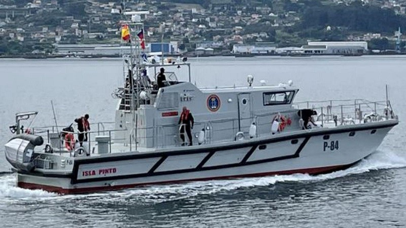

# Patrulleros Clase Toralla (P-80)
Estos patrulleros tienen la misión principal de efectuar operaciones de **vigilancia y seguridad marítima** en las aguas de soberanía y de interés nacional.

También realizan colaboraciones con otros organismos estatales como la Sociedad Estatal de Salvamento Marítimo, la Guardia Civil...

Los patrulleros que siguen ahora mismo en activo son:

- **Patrullero Toralla (P-81)** -- Cartagena

</img>

- **Patrullero Formentor (P-82)** -- Cartagena

</img>

- **Patrullero Isla de León (P-83)** -- Ceuta

</img>

- **Patrullero Isla Pinto (P-84)** -- Melilla

</img>
