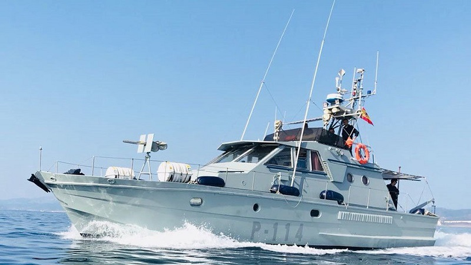

# Patrulleros de Vigilancia Costera (P-110)
Estos patrulleros tienen como misión principal la **vigilancia del Golfo de Cádiz**, la protección de los **pesqueros españoles** en la zona y la **vigilancia del tráfico** de mercancías e inmigración ilegal.

El patrullero que sigue ahora mismo en activo es:

- **Patrullero P-114** -- Ayamonte

</img>
