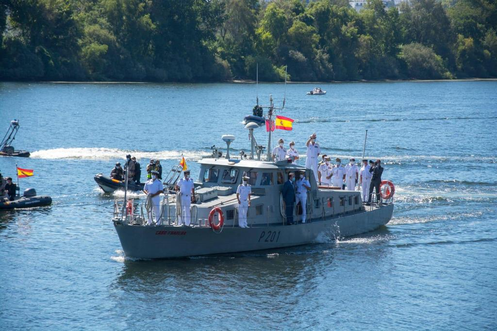

# Patrulleros de Vigilancia Interior (P-200)
Este patrullero contribuye a la **regulación del aprovechamiento público** y mantienen las condiciones de navegabilidad del TIRM, preservando y protegiendo los intereses nacionales garantizando el cumplimiento de dicho Tratado en el **río Miño**.

El patrullero que sigue ahora mismo en activo es:

- **Patrullero Cabo Fradera (P-201)** -- Tui

</img>
