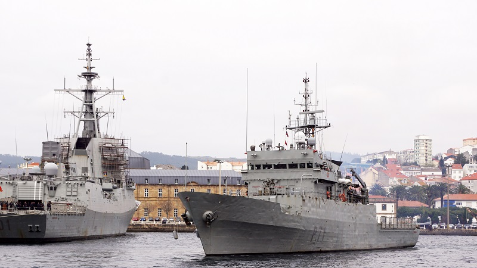

# Patrulleros y Buques de Cooperación Pesquera
Los Patrulleros y Buques de Cooperación Pesquera son buques diseñados para **vigilancia marítima, protección de aguas territoriales y apoyo en misiones de seguridad y control pesquero**.

Su principal función es **garantizar el cumplimiento de la normativa en la mar**, proteger los intereses nacionales y colaborar en operaciones de rescate y lucha contra el tráfico ilegal.

Sus capacidades generales son:

- **Vigilancia** y protección de aguas territoriales.

- **Apoyo** a operaciones de seguridad marítima y lucha contra el **tráfico ilegal**.

- **Supervisión y control de la actividad pesquera** en coordinación con organismos nacionales e internacionales.

- Participación en misiones de **cooperación** con otras fuerzas navales y guardacostas.

- Apoyo a **operaciones de búsqueda y rescate**.

Depende del tipo de patrullero navegará más o menos.

En la Armada Española, tenemos varias clases de patrulleros repartidos por España:

- **Patrulleros Clase Anaga (P-20)** -- Málaga / Cádiz / Marín

- **Patrulleros de Cooperación Pesquera (P-60)** -- Cartagena / Ferrol

- **Patrulleros Clase Serviola (P-70)** -- Ferrol / Cádiz / Cartagena

- **Patrulleros Clase Toralla (P-80)** -- Cartagena / Ceuta / Melilla

- **Patrulleros de Vigilancia Costera (P-110)** -- Ayamonte

- **Patrulleros de Vigilancia Interior (P-200)** -- Tui

</img>