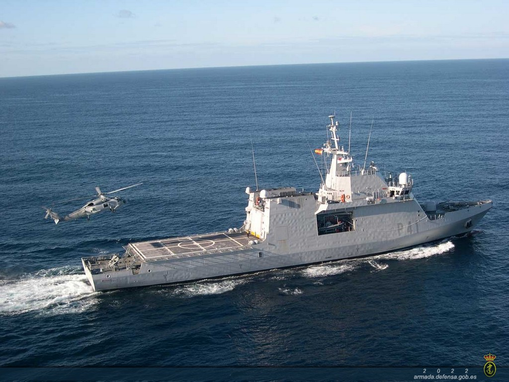
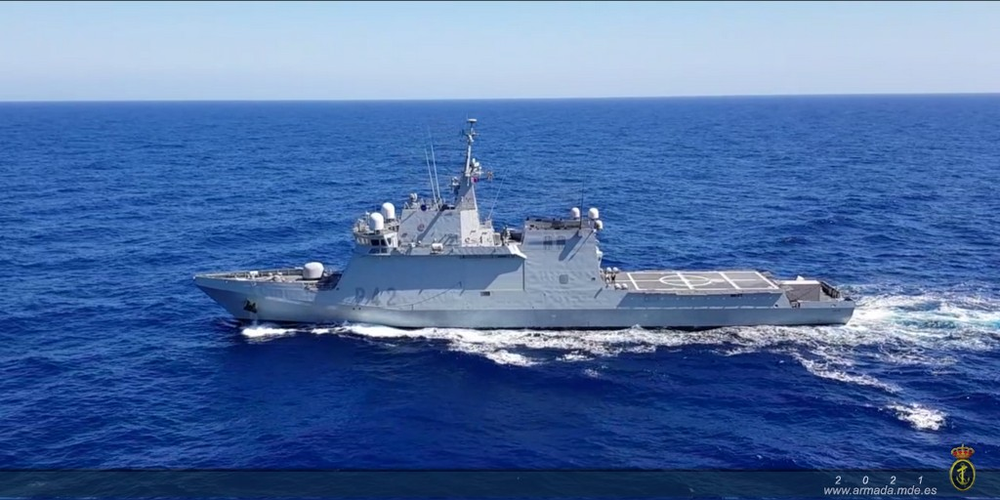
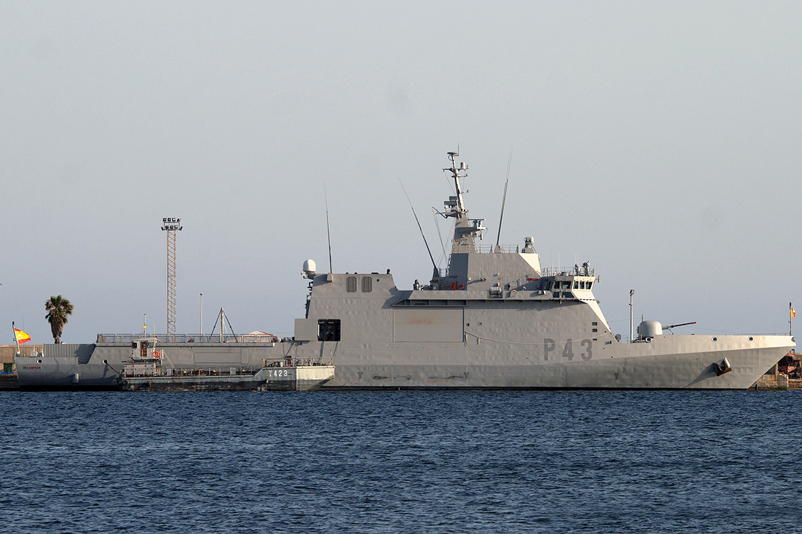
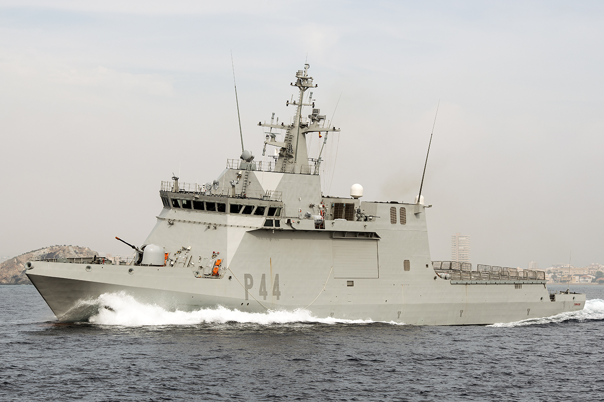
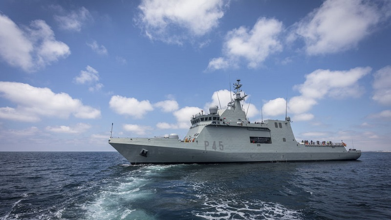
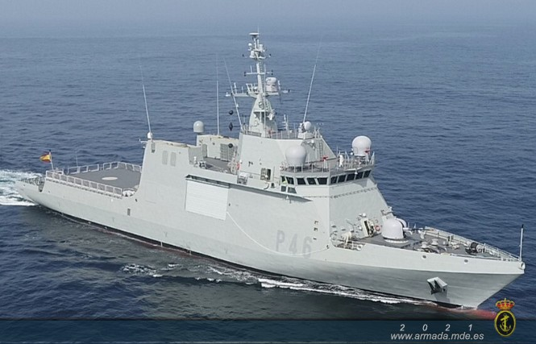

# Clase Meteoro (P-40)
Estos buques son:

- **B.A.M. Meteoro (P-41)** -- Las Palmas de Gran Canaria

</img>

- **B.A.M. Rayo (P-42)** -- Las Palmas de Gran Canaria

</img>

- **B.A.M. Relámpago (P-43)** -- Las Palmas de Gran Canaria

</img>

- **B.A.M. Tornado (P-44)** -- Las Palmas de Gran Canaria

</img>

- **B.A.M. Audaz (P-45)** -- Cartagena

</img>

- **B.A.M. Furor (P-46)** -- Cartagena

</img>
