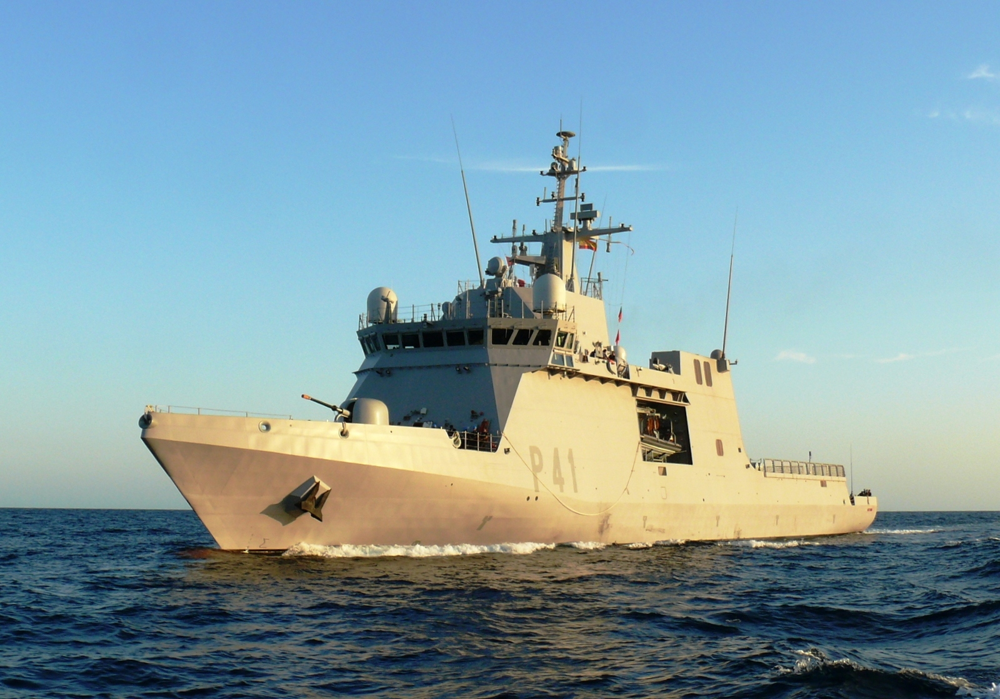

# Buques de Acción Marítima
Los Buques de Acción Marítima (B.A.M.) son unidades diseñadas para misiones de **vigilancia, seguridad y apoyo en alta mar**, con un enfoque en la protección de los intereses nacionales en aguas territoriales y zonas de proyección estratégica.

Son **versátiles** y cuentan con tecnología moderna para operar en distintos escenarios, desde la **lucha contra el tráfico ilegal** hasta **misiones de cooperación internacional**.

Suelen navegar entre **5 y 7 meses al año**, dependiendo de su misión. Por ejemplo en operaciones como la Operación Atalanta donde se lucha contra la piratería en el Índico, pueden estar hasta 4 meses seguidos desplegados. También pueden realizar patrullas de semanas a pocos meses de vigilancia marítima y seguridad en aguas nacionales.

En la Armada Española tenemos la **Clase Meteoro (P-40)**, que cuenta con 6 Buques de Acción Marítima de los cuales 4 están en Las Palmas de Gran Canaria y 2 en Cartagena. Todos tienen una dotación de entre **45 y 52 personas**.

</img>
