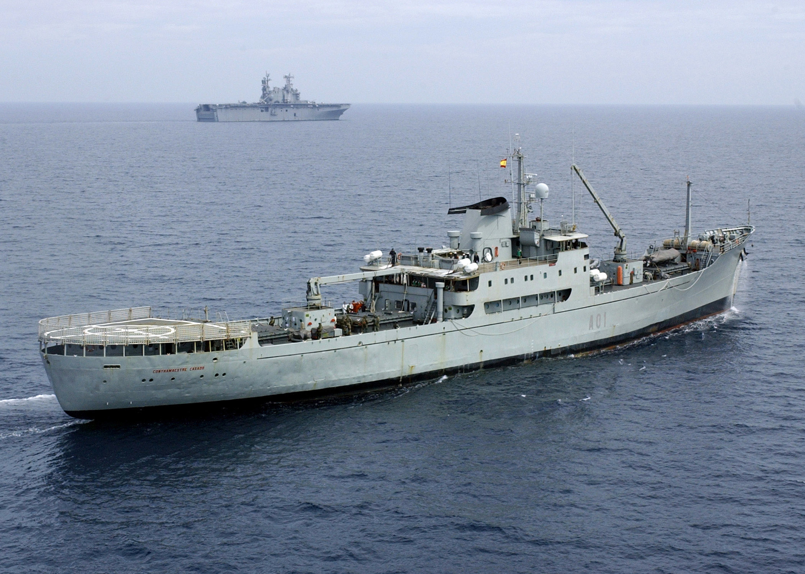
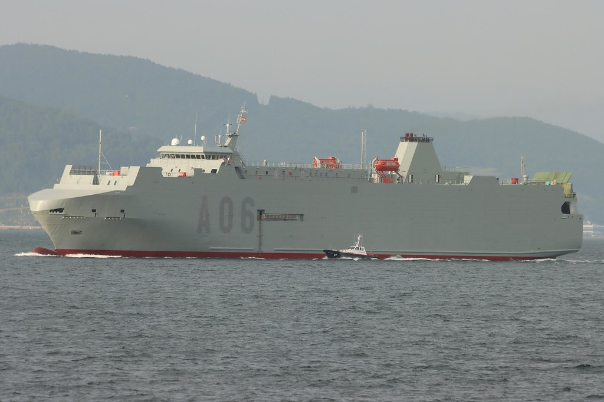
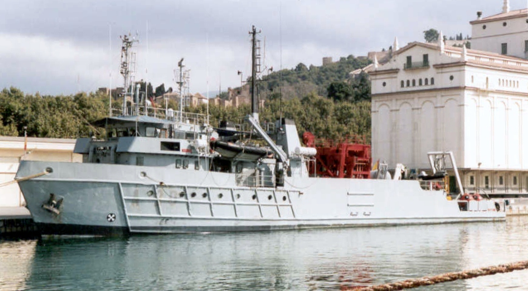
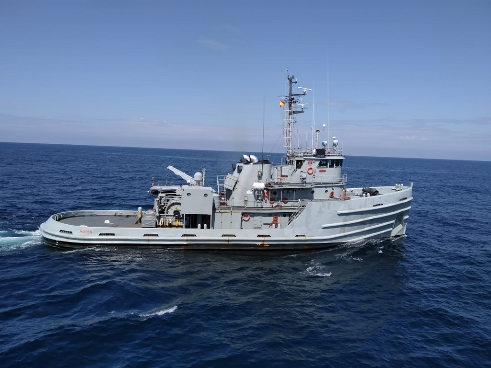
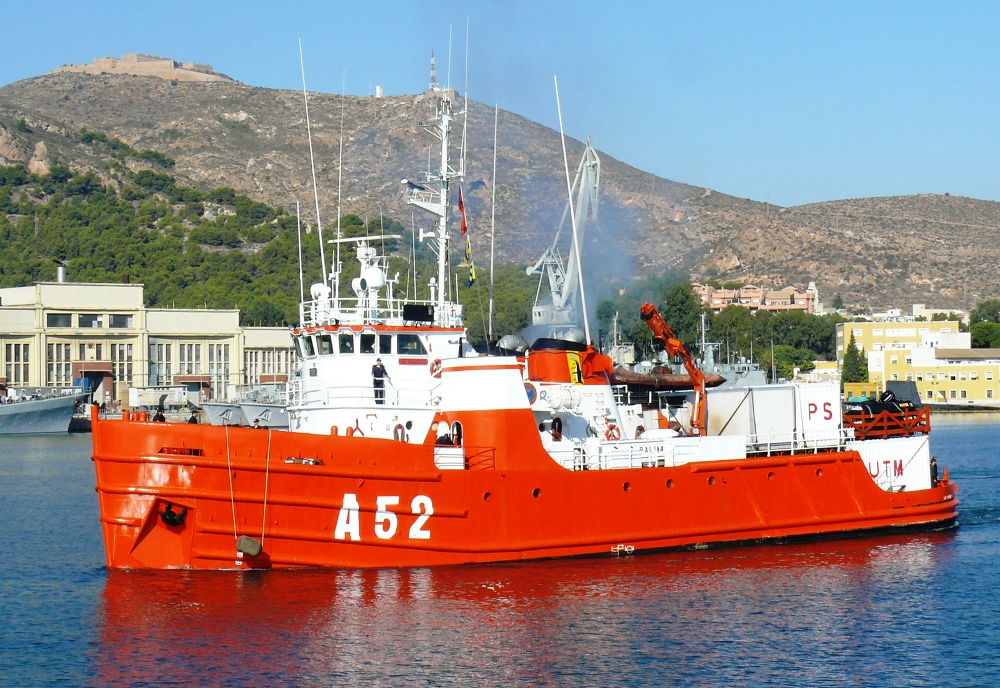
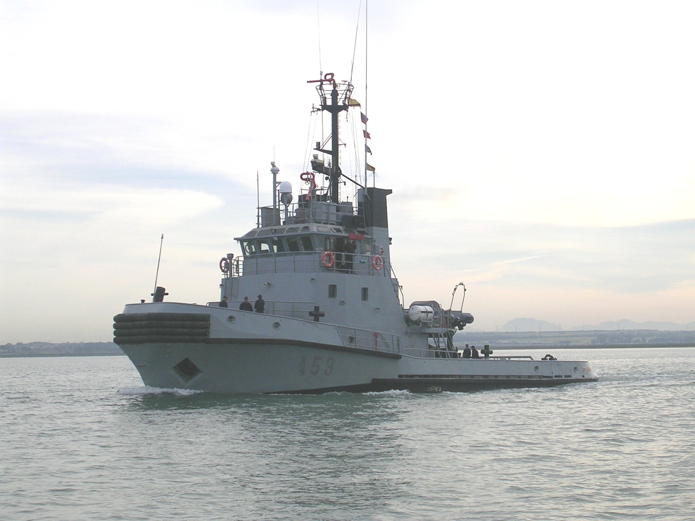
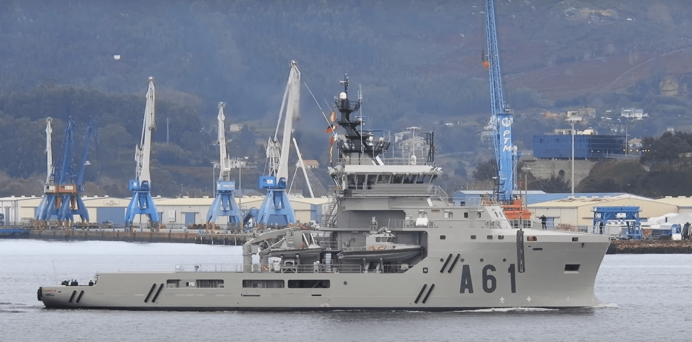
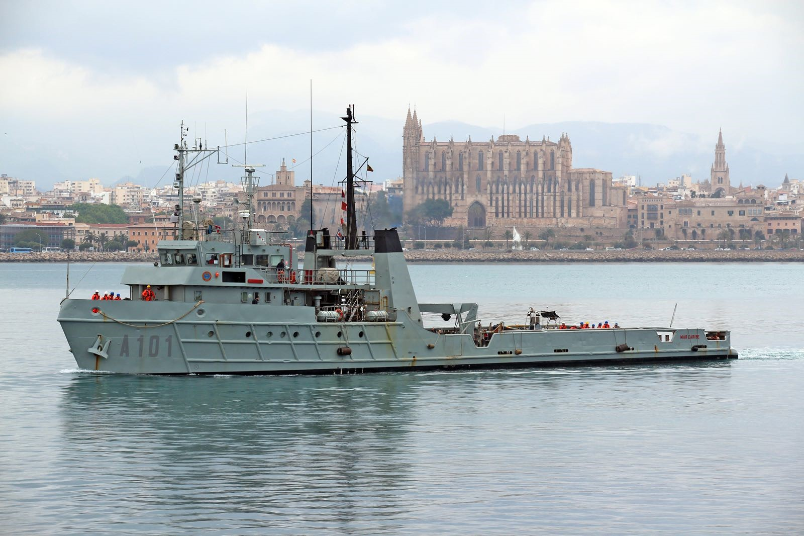
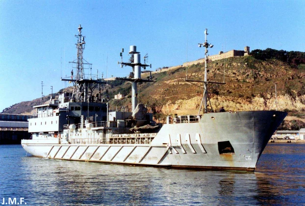

# Buques Auxiliares
Los Buques Auxiliares cumplen funciones de **apoyo logístico, salvamento, transporte y remolque**, asegurando el correcto funcionamiento de la flota en diversas misiones.

Son esenciales para el sostenimiento de las operaciones navales, tanto en tiempos de paz como en escenarios de crisis. Pueden navegar desde días a meses (**3 o 4 meses** seguidos como mucho).

Hay varios tipos de Buques Auxiliares en la Armada Española:

- **Transporte Ligero Contramaestre Casado (A-01)** -- Rota

Con una dotación de unas 65 personas, tiene la misión de efectuar transportes logísticos tanto de personal como de material.

</img>

- **Buque Transporte Logístico Ysabel (A-06)** -- Cartagena

Con una dotación de unas 50 personas, su misión es el transporte logístico de vehículos y material del Ejército de Tierra entre la península, los archipiélagos Balear y Canario y las ciudades autonómicas Ceuta y Melilla.

</img>

- **Buque de Salvamento Neptuno (A-20)** -- Cartagena

Con una dotación de unas 55 personas, tiene la misión de planear y ejecutar operaciones de apoyo al salvamento y rescate de submarinos accidentados.

</img>

- **Remolcador Mahón (A-51)** -- Ferrol

Con una dotación de unas 30 personas, su misión es proporcionar remolque oceánico a los buques de la Armada. También realizan labores de Vigilancia y Seguridad Marítima.

</img>

- **Buque Auxiliar Las Palmas (A-52)** -- Cartagena

Con una dotación de unas 35 personas, su misión es apoyar a misiones científicas y oceanográficas y proporcionar apoyo logístico. Fue usado en misiones antárticas antes de la incorporación del Hespérides.

</img>

- **Remolcador La Graña (A-53)** -- Cádiz

Con una dotación de unas 25 personas, su misión es:

- Colaborar en ejercicios de tiro con diferentes ejércitos
- Colaborar en ejercicios de remolque con unidades de la Armada
- Colaborar en la vigilancia marítima y pesquera de nuestras costas
- Colaborar con unidades de la Armada en ejercicios de adiestramiento

</img>

- **Buque Multipropósito Carnota (A-61)** -- Ferrol

Con una dotación de unas 35 personas, el Buque Multipropósito Carnota es muy versátil y tiene varias misiones importantes:

- Remolque
- Vigilancia marítima
- Apoyo logístico para el traslado de personal
- Apoyo a buques

</img>

- **Buque Auxiliar Mar Caribe (A-101)** -- Cádiz

Con una dotación de unas 30 personas, su misión es realizar remolques, hacer patrullas marítimas, fondear y recoger minas, torpedos y boyas, realizar operaciones de salvamento y rescate...

</img>

- **Buque Auxiliar Alerta (A-111)** -- Cartagena

Con una dotación de unas 60 personas, su misión principal es el transporte logístico entre puertos nacionales e internacionales.

</img>
