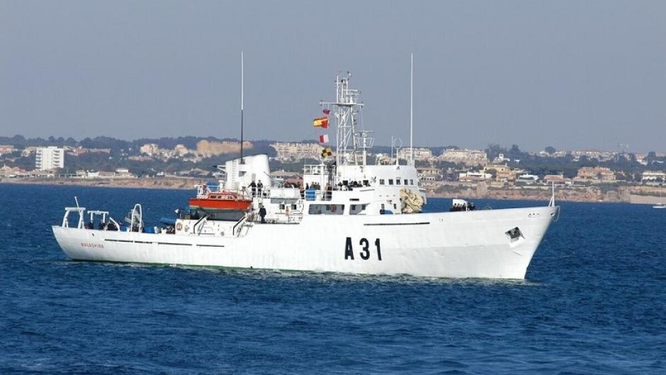
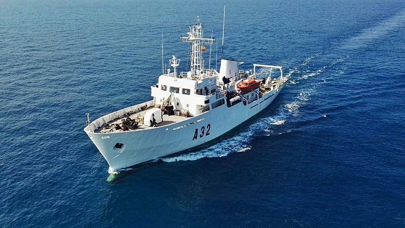
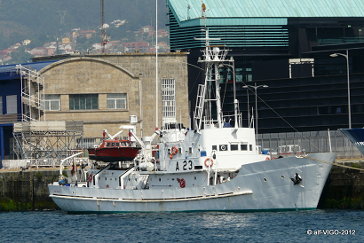
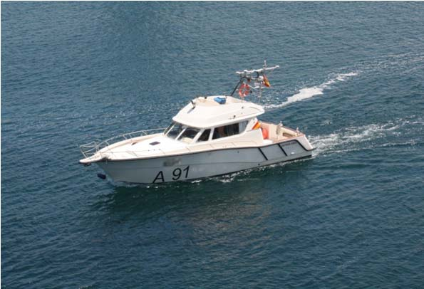
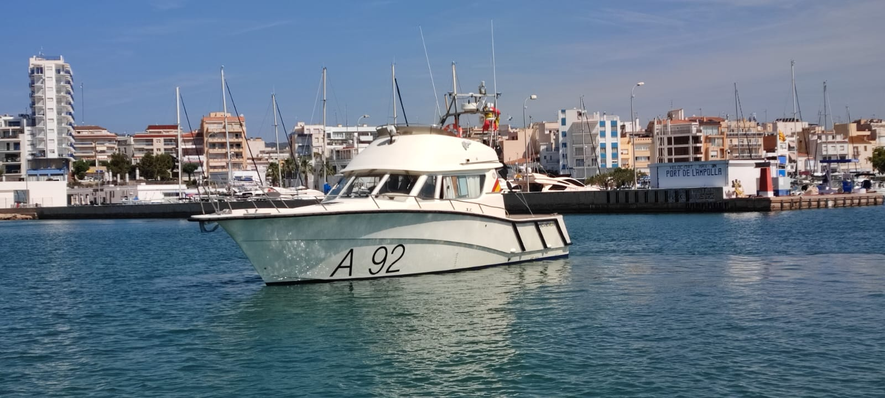
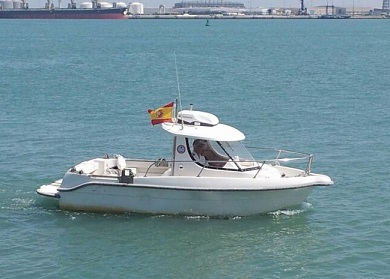

# Buques Hidrográficos
Los Buques Hidrográficos tienen como principal misión la **cartografía naval y el estudio de los fondos marinos**, garantizando la seguridad en la navegación y proporcionando datos esenciales para operaciones navales militares y civiles.

Estos buques suelen realizar despliegues de **varias semanas a 2-3 meses**, dependiendo de la misión. Puden operar en campañas prolongadas de hasta **4-6 meses al año**, aunque con rotaciones y escalas en puerto.

En la Armada Española tenemos:

- **Clase Malaspina (A-30)** -- San Fernando
        
    - **Buque Hidrográfico Malaspina (A-31)**
    
    Tiene una dotación de unas 70 personas.

    </img>

    - **Buque Hidrográfico Tofiño (A-32)**
    
    Tiene una dotación de unas 60 personas.

    </img>

- **Buque Hidrográfico Antares (A-23)** -- Cádiz

</img>

- **Lanchas Hidrográficas** -- Cádiz

    Tienen una dotación de unas 10 personas.

    - **LHT Astrolabio (A-91)**

    </img>

    - **LHT Escandallo (A-92)**

    </img>

    - **LHT Sondaleza (A-93)**

    </img>
