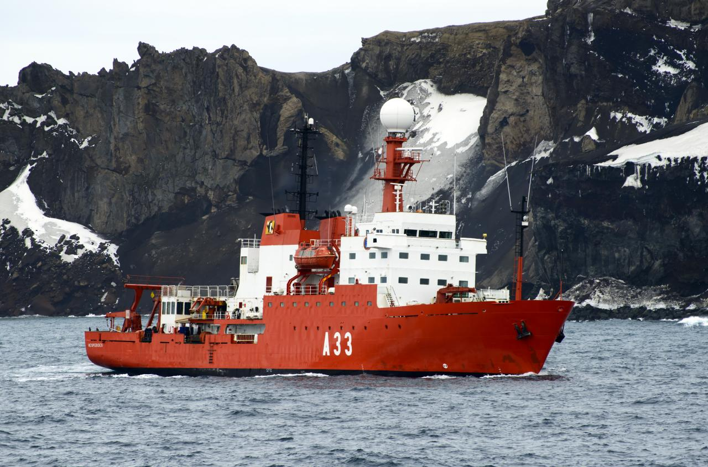
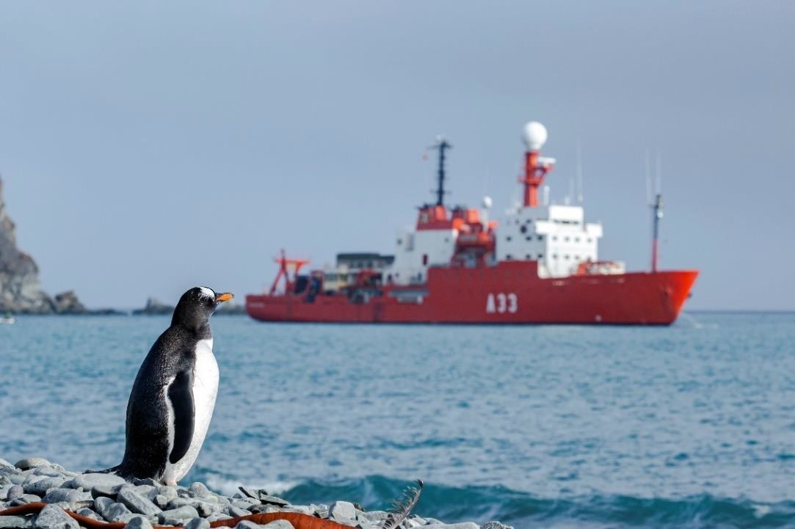
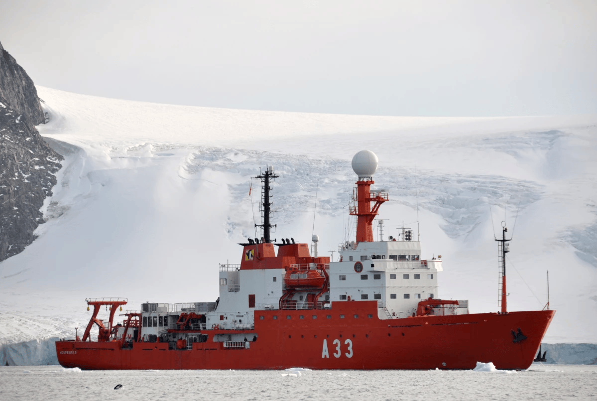

# Buque de Investigación Oceanográfica - Hespérides (A-33)
El **B.I.O. Hespérides (A-33)** es el Buque de Investigación Oceanográfica de la Armada Española y tiene su base en el Arsenal Militar de Cartagena.

Está diseñado para realizar **misiones científicas** en los mares y océanos del mundo, con especial protagonismo en la **Antártida**.

Sus funciones generales son:

- Apoyo a **investigaciones científicas en oceanografía**, biología marina, geología y climatología.

- Operaciones en **condiciones extremas**, incluyendo misiones en la Antártida.

- Colaboración con **instituciones científicas** nacionales e internacionales.

- **Transporte y suministro** a bases científicas en zonas polares.

Y sus características generales son:

- Capacidad para operar en **aguas polares** gracias a su casco reforzado.

- Equipado con laboratorios, sistemas de análisis oceanográfico y sensores avanzados.

- Autonomía de hasta 6 meses, con una media de unos **8 meses de navegación al año**.

- Puede alojar a más de **30 científicos mas los 60 militares** que componen su dotación.

