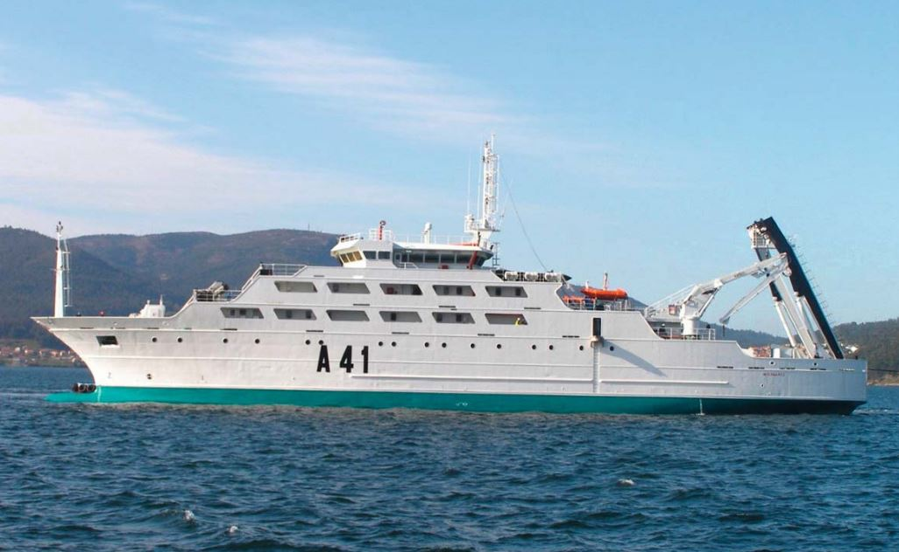

# B.E. Intermares (A-41)
El **Buque Escuela Intermares (A-41)** es un buque de instrucción especializado en la **formación pesquera y cooperación** internacional en materia marítima.

Su objetivo es capacitar a profesionales del **ámbito naval y pesquero**, promoviendo el desarrollo sostenible de la actividad pesquera.

Sus funciones principales son:

- **Formación en técnicas** de pesca, navegación y gestión de recursos marinos.

- Cooperación internacional en la **formación marítima y pesquera**.

- **Apoyo en misiones de desarrollo sostenible** de la pesca en distintos países.

Y sus características generales son:

- Dotación de unas **35 personas**, con capacidad para unos 50 alumnos.

- Misiones que duran entre **semanas y varios meses**.

</img>
