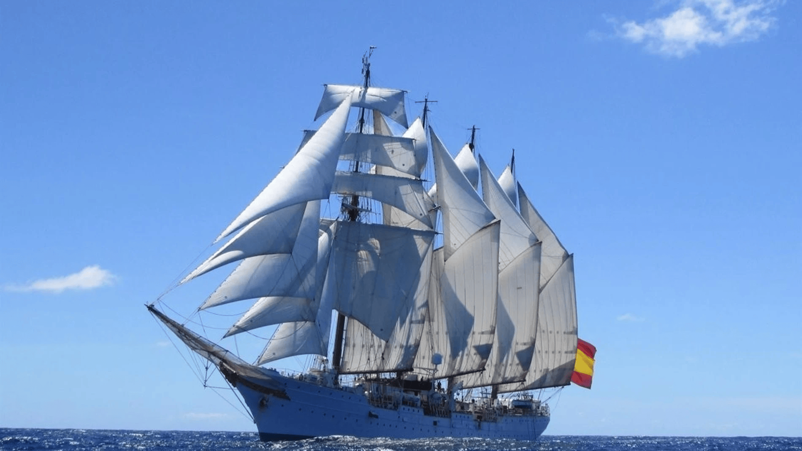
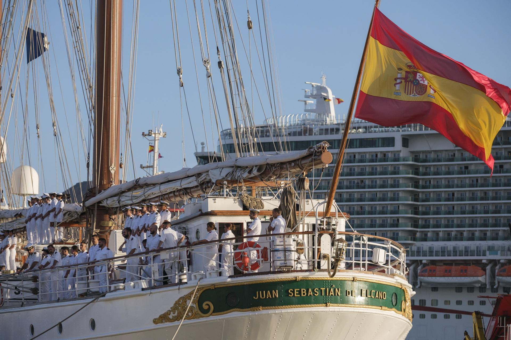

# B.E. Juan Sebastián Elcano (A-71)
El **Buque Escuela Juan Sebastián Elcano (A-71)** es el buque más **emblemático** de la Armada Española. Este **bergantín-goleta de cuatro mástiles** ha servido desde **1928** como plataforma de formación para los **futuros oficiales** (guardiamarinas de 3º año) de la Armada Este buque es una **embajada flotante** de España.

Sus funciones principales son:

- **Formación y adiestramiento** de los guardiamarinas en maniobra y navegación.

- **Representación de la Armada Española y de España** en misiones diplomáticas y eventos internacionales.

- Desarrollo de **liderazgo, disciplina y trabajo en equipo** entre la dotación y los alumnos.

Y sus características generales son:

- Dotación de aproximadamente **170 personas mas unos 80 guardiamarinas**.

- Crucero estándar de **6 meses a América**.

</img>

</img>

</img>
