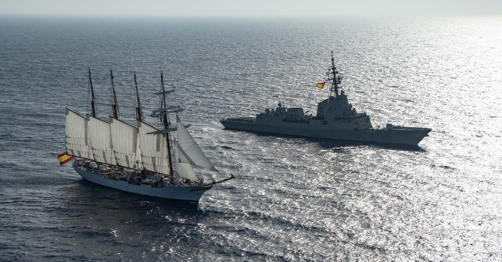

# Buques Escuela
La Armada Española tiene 2 Buques Escuela diseñados para la formación y el adiestramiento de los futuros oficiales y suboficiales:

- **B.E. Intermares (A-41)** -- Ferrol

- **B.E. Juan Sebastián Elcano (A-71)** -- San Fernando

</img>
